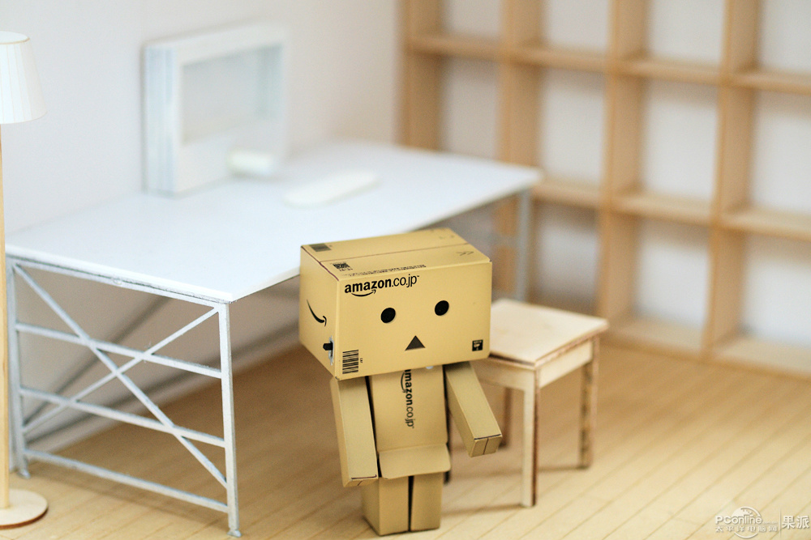
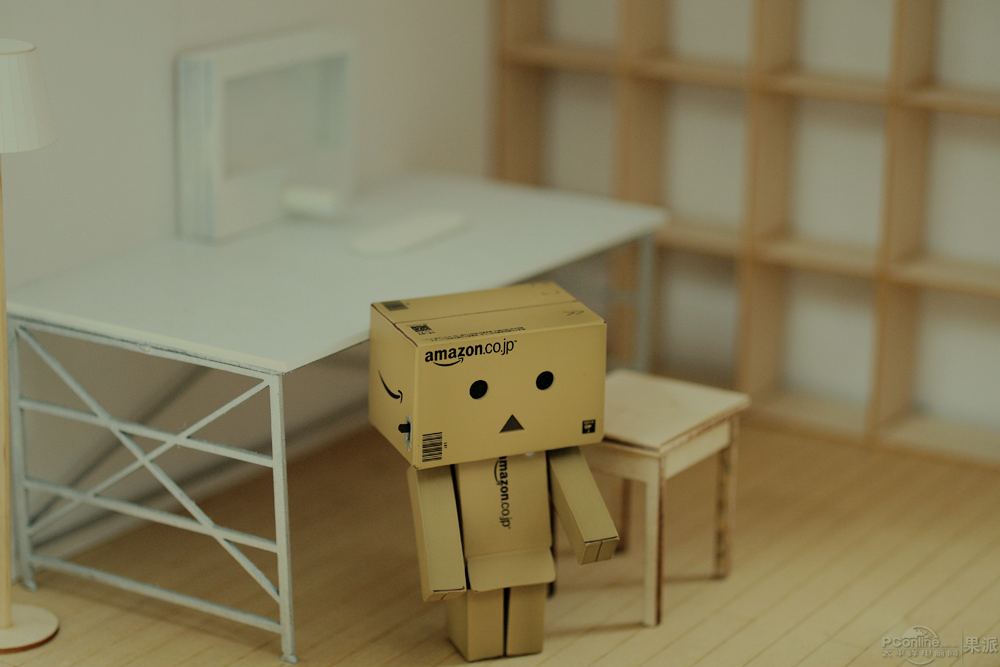
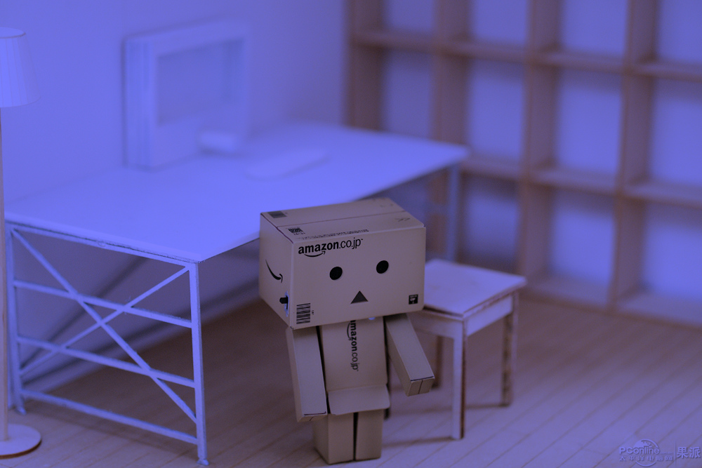

# HW1-Q1
改變圖片中RGB三色所佔的比例
* 首先程式會詢問你想要改變何種顏色所佔的比例。
* 接下來輸入希望該顏色所佔的比例。
* 輸出結果圖片。

# Implementation
以之前meeting的專案為基底，pixptr[0] ,pixptr[1] ,pixptr[2]分別代表Blue ,Green ,Red三種顏色，<br/>
以enum將{0,1,2,3}命名為{ ORIGIN, BLUE, GREEN, RED }，作為下面switch case的control input，<br/>
先以第一個input決定要變更哪個顏色的比例，再利用第二個input作為變數算出另外兩個顏色所佔的比例，<br/>
最後顯示出結果圖片。<br/>
```

#include "stdafx.h"
#include <iostream>
#include <opencv2\opencv.hpp>

using namespace cv;
using namespace std;

int main(){
	enum{ ORIGIN, BLUE, GREEN, RED };
	cv::Mat image;
	image = cv::imread("../image/aleng.jpg");   // Read the file
	uchar *pixptr;
	int a;
	float b;
	if (image.empty()){
		std::cout << "圖片不見了QQ";
		system("pause");
		return 0;
	}
	cout << "Whitch colar you would like to change?  (ORIGIN=0,BLUE=1,GREEN=2,RED=3)\n";
	cin >> a;
	switch (a)
	{
	case ORIGIN:

		for (int i = 0; i<image.rows; i++){
			pixptr = image.ptr<uchar>(i);
			for (int j = 0; j<image.cols; j++){
				pixptr[0] = pixptr[0] * 1;
				pixptr[1] = pixptr[1] * 1;
				pixptr[2] = pixptr[2] * 1;
				pixptr += 3;
			}
		}
		break;
	case BLUE:
		cout << "how much percentage would like blue to be ? (ex : 50 )\n";
		cin >> b;
		b = b / 100;
		for (int i = 0; i<image.rows; i++){
			pixptr = image.ptr<uchar>(i);
			for (int j = 0; j<image.cols; j++){
				pixptr[0] = pixptr[0] * b * 2;
				pixptr[1] = pixptr[1] * (1 - b);
				pixptr[2] = pixptr[2] * (1 - b);
				pixptr += 3;
			}
		}
		break;
	case GREEN:
		cout << "how much percentage would like green to be ? (ex : 50 )\n";
		cin >> b;
		b = b / 100;
		for (int i = 0; i<image.rows; i++){
			pixptr = image.ptr<uchar>(i);
			for (int j = 0; j<image.cols; j++){
				pixptr[0] = pixptr[0] * (1 - b);
				pixptr[1] = pixptr[1] * b * 2;
				pixptr[2] = pixptr[2] * (1 - b);
				pixptr += 3;
			}
		}
		break;
	case RED:
		cout << "how much percentage would like red to be ? (ex : 50 )\n";
		cin >> b;
		b = b / 100;
		for (int i = 0; i<image.rows; i++){
			pixptr = image.ptr<uchar>(i);
			for (int j = 0; j<image.cols; j++){
				pixptr[0] = pixptr[0] * (1 - b);
				pixptr[1] = pixptr[1] * (1 - b);
				pixptr[2] = pixptr[2] * b * 2;
				pixptr += 3;
			}
		}
		break;
	default:
		cout << "sorry,please enter number between 0 to 3 !!";
		break;
	}

	if (a <= 3)
	{
		cv::imwrite("../image/Result1.png", image);
		cv::imshow("Traverse result", image);
		cv::waitKey(0);
	}
	return(0);
}
```

# Theory
* 三原色光模式

# Disparity result
操作介面:<br/>
<br/>
原圖:<br/>
<br/>
如果輸入33%會顯示出亮度較低的原色:<br/>
<br/>
輸入藍色50%顯示出的結果:<br/>
<br/>

# Reference
1.  meeting 的 專案<br/>
